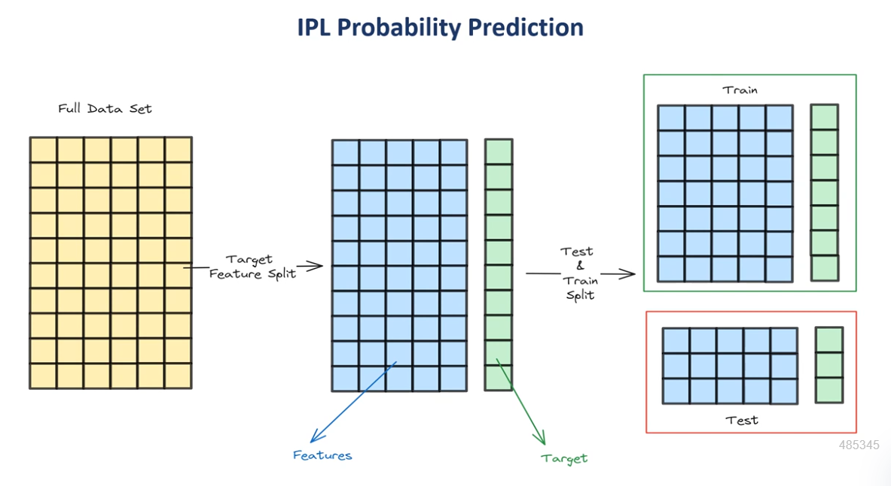

---

# IPL Victory Probability Estimator

## Overview

The IPL Victory Probability Estimator is a predictive model designed to forecast the outcomes of IPL (Indian Premier League) matches based on historical match data. This project leverages machine learning algorithms to analyze IPL match statistics and provide a probability of victory for each team, aiding cricket enthusiasts and analysts in gaining deeper insights into the game.

## Features

- Predict the outcome of an IPL match based on historical data.
- Interactive web application for real-time predictions using Streamlit.
- Data analysis using pandas and machine learning model training in Python.
- Model saved and deployed using pickle for easy integration.
- Visualization of model training process and results.

## Technologies Used

- **Python**: Main programming language used for model development.
- **Jupyter Notebook**: For data analysis and model training.
- **pandas**: Data manipulation and analysis.
- **pickle**: For saving and loading machine learning models.
- **Streamlit**: Framework for building the interactive web application.
- **Scikit-learn**: Machine learning library used for model training.

## Installation

1. Clone the repository:

   ```bash
   git clone https://github.com/your-username/ipl-victory-probability-estimator.git
   ```

2. Navigate to the project directory:

   ```bash
   cd ipl-victory-probability-estimator
   ```

3. Install the required dependencies:

   ```bash
   pip install -r requirements.txt
   ```

4. Run the Streamlit app:
   ```bash
   streamlit run app.py
   ```

## Dataset

The dataset used in this project is the IPL match dataset from Kaggle, which includes various match statistics such as runs, wickets, overs, and player performances. The dataset helps in building the predictive model to estimate the probability of a team winning.

This is a kaggle dataset where we have 5 Files but we are focused only on 2 Files : 
1. matches.csv $\rightarrow$ Has each match analysis
2. deliveries.csv $\rightarrow$ Has each ball analysis.

##### Data Set Link : https://www.kaggle.com/datasets/ramjidoolla/ipl-data-set 

## Model Training and Visualization

The model was trained using historical IPL match data. Various machine learning algorithms were tested, and the final model was selected based on accuracy. Below are some visualizations of the model training process:

- **Model Accuracy Graph**: Shows how different models performed.
- **Confusion Matrix**: For evaluating the model's performance.
- **Feature Importance**: Displays the significance of each feature in predicting the match outcome.

_(Add presentation images and videos of the model training process here)_

## Usage

Once the app is running, users can input the following match details:

- Team 1 and Team 2
- Venue
- Key player statistics (optional)

The model will output the predicted probability of victory for each team, giving users insights into the potential match outcome.

## Contributing

Feel free to fork this repository, make improvements, or submit pull requests. Contributions are welcome!

## License

This project is licensed under the MIT License - see the [LICENSE](LICENSE) file for details.

## Model Training Process





## Website Video

You can view the process in the video below:


<video width="600" controls>
  <source src="https://raw.githubusercontent.com/Nitish2773/IPL-Victory-Probability-Estimator/main/images/IPL_Victory_Probability_Estimator.mp4" type="video/mp4">
  Your browser does not support the video tag.
</video>
